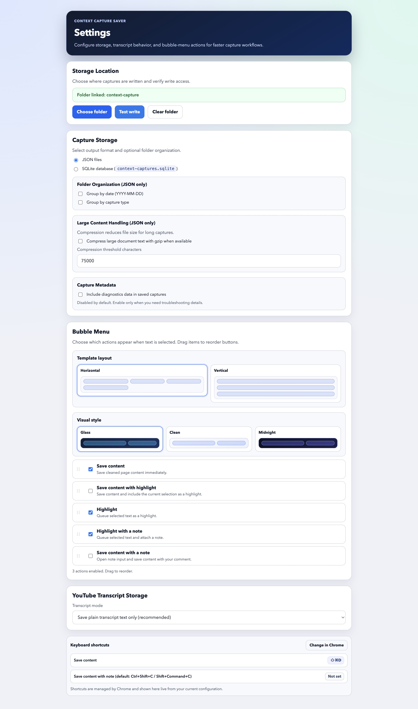
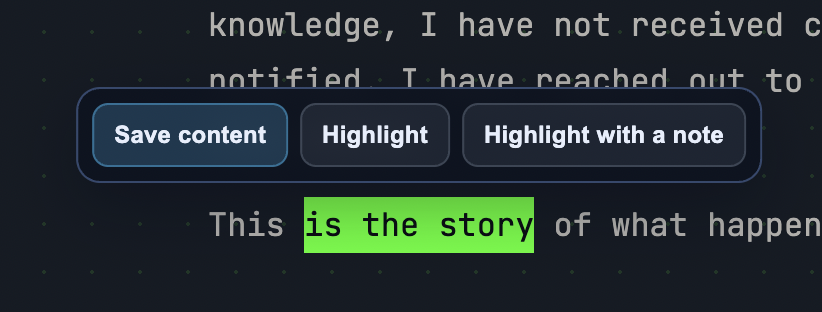

# Context Capture Saver

Capture the useful part of web pages, PDFs, and YouTube transcripts to local files you control.

Context Capture Saver is built for research and AI workflows where you need clean, structured content without copy/paste noise.

## Screenshots

### Settings Page



### Bubble Menu



## Why Use It

- Save the main content from pages, not just raw HTML.
- Keep highlights and notes together with the capture.
- Store data locally in JSON or SQLite.
- Export content that is ready for AI agents and downstream processing.

## Core Features

- Website capture with cleaned article-focused text.
- Save content with or without notes.
- Highlight queue and highlight-with-note workflow.
- YouTube transcript capture with multiple transcript storage modes.
- PDF text extraction with metadata.
- Automatic word count, character count, and content hash.
- Optional diagnostics metadata (off by default).
- Customizable bubble menu:
  - enable/disable actions
  - drag-and-drop ordering
  - template layout (`Horizontal` or `Vertical`)
  - visual styles (`Glass`, `Clean`, `Midnight`)
- Live shortcut display in settings with direct link to Chrome shortcut editor.

## Install

### Option 1: From release (recommended)

1. Download `context-capture-saver.zip` from the latest release.
2. Unzip it.
3. Open `chrome://extensions`.
4. Enable **Developer mode**.
5. Click **Load unpacked** and select the unzipped folder.

### Option 2: From source

1. Clone this repository.
2. Run:

```bash
npm ci
npm run build
```

3. Open `chrome://extensions`.
4. Enable **Developer mode**.
5. Click **Load unpacked** and select `dist/`.

## Setup (First Time)

1. Open extension settings.
2. Choose your storage folder.
3. Optional: run **Test write**.
4. Configure your preferred:
   - storage backend (`JSON` or `SQLite`)
   - folder organization (JSON mode)
   - large-content compression (JSON mode)
   - diagnostics inclusion
   - bubble template layout/style and actions

## How You Capture

### Websites

Use right-click menu, shortcuts, or bubble menu actions:

- Save content
- Save content with note
- Save content with highlight
- Highlight
- Highlight with note

### YouTube

On supported YouTube video pages:

- Save transcript
- Save transcript with note

Transcript storage modes:

- plain transcript text only
- timestamped lines only
- both

### PDFs

- Extracts page text and PDF metadata.
- Right-click capture and highlight actions are supported.
- Chrome’s built-in PDF viewer can still limit inline overlay behavior in some cases.

## Keyboard Shortcuts

Default shortcuts:

- macOS: `Shift + Command + D`, `Shift + Command + C`
- Windows/Linux: `Ctrl + Shift + D`, `Ctrl + Shift + C`

You can change shortcuts in `chrome://extensions/shortcuts`.
The settings page shows currently configured values.

## Saved Data

Each capture includes:

- source metadata (URL, title, site, etc.)
- capture metadata (`savedAt`, `contentHash`)
- cleaned `documentText` (or transcript content)
- `documentTextWordCount`
- `documentTextCharacterCount`
- annotations (when present)
- optional diagnostics (if enabled)

## Privacy

- Data is written only to your selected local folder.
- No required external backend.
- No cloud dependency for normal capture workflow.

## Known Limitations

- Some YouTube videos do not expose transcript/caption data.
- Chrome PDF viewer restrictions can block some inline selection UX paths.

## Development

```bash
npm ci
npm run lint
npm run typecheck
npm run test:ci
npm run build
```

## Contributing

Issues and PRs are welcome.

When contributing:

1. Keep changes scoped and tested.
2. Run lint, typecheck, and tests before opening a PR.
3. Include a short summary of behavior changes in your PR description.
