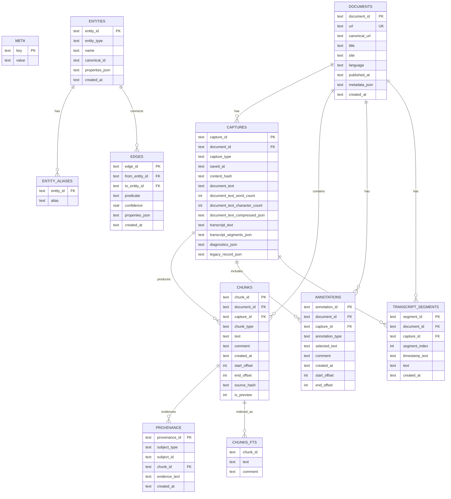

# Context Capture Saver

Capture useful context from websites, PDFs, and YouTube transcripts into local JSON and/or SQLite storage you control.

Context Capture Saver is designed for research and AI workflows where you want structured, provenance-aware data instead of ad hoc copy/paste.

## Screenshots

### Settings Page


### Bubble Menu


## Key Features

- Capture article-focused page content, not raw HTML.
- Save with notes, highlights, and queued highlight workflows.
- YouTube transcript capture with transcript-only, timestamped-segments-only, or both.
- Bubble menu support on YouTube selections, including transcript save actions.
- PDF extraction with metadata and selection-aware capture support.
- Local storage backends: `JSON` (default), `SQLite`, and `JSON + SQLite` (write both).
- JSON output is always written under `json/` inside the selected folder.
- Optional structured JSON chunks (`content.chunks`) in addition to full `documentText`.
- SQLite backend uses a graph-ready schema for analytics and AI agent workflows.
- Automatic migration of legacy SQLite databases (`captures`-only schema) to the latest schema.
- Pending highlights/notes panel now shows queued annotations on-page with delete controls before save.

## Browser Support

- Chrome/Chromium (Manifest V3)
- Firefox build output included in the same pipeline

### Firefox Differences

- `chrome.offscreen` is not always available; the extension now detects this and uses module-based fallbacks for PDF extraction.
- Clipboard-assisted fallback paths can be more limited on Firefox; on-page selection remains the primary workflow.
- Runtime capability info is captured in diagnostics for PDF captures when diagnostics are enabled.

### Firefox Verification Checklist

- Manual:
  - Verify context menus toggle between regular and YouTube actions based on tab URL.
  - Verify PDF capture works with module fallback on Firefox.
  - Verify highlight/note queueing works on regular pages and PDF pages.
  - Verify JSON, SQLite, and JSON+SQLite save modes all write successfully.
  - Verify bubble menu actions work and update after settings changes.
- Automated:
  - Run `npm run check`
  - Run `npm run typecheck`
  - Run `npm test`

## Install

### Option 1: Release Artifacts

- Chrome package: `context-capture-saver-chrome.zip` (and compatibility alias `context-capture-saver.zip`)
- Firefox package: `context-capture-saver-firefox.zip`

### Option 2: Build From Source

```bash
npm ci
npm run build
```

Build outputs:

- Chrome unpacked extension: `dist/chrome/`
- Firefox unpacked add-on: `dist/firefox/`
- Chrome zip: `dist/context-capture-saver-chrome.zip`
- Firefox zip: `dist/context-capture-saver-firefox.zip`

Load in browsers:

1. Chrome: open `chrome://extensions`, enable Developer mode, click **Load unpacked**, select `dist/chrome/`.
2. Firefox (temporary): open `about:debugging#/runtime/this-firefox`, click **Load Temporary Add-on**, select `dist/firefox/manifest.json`.

## Build Commands

```bash
npm run build         # build both Chrome + Firefox
npm run build:chrome  # build only Chrome
npm run build:firefox # build only Firefox
```

## First-Time Setup

1. Open extension options.
2. Choose a local folder with read/write permission.
3. Run **Test write** (optional but recommended).
4. Configure:
   - storage backend (`JSON`, `SQLite`, `JSON + SQLite`)
   - JSON folder organization options
   - compression and diagnostics options
   - optional JSON structured chunk export
   - bubble menu layout/style/actions

## Capture Workflows

### Websites

Use right-click menus, shortcuts, popup, or bubble actions:

- Save content
- Save content with note
- Save content with highlight
- Highlight
- Highlight with note

### YouTube

On supported YouTube video pages:

- Save transcript
- Save transcript with note
- Selection bubble includes YouTube transcript actions

Transcript storage modes:

- plain transcript text
- timestamped transcript segments
- both

### PDFs

- Extracts text + metadata
- Supports capture and highlight actions
- Browser PDF viewer behavior can still affect some selection UX

## Keyboard Shortcuts

Default shortcuts:

- macOS: `Shift + Command + D`, `Shift + Command + C`
- Windows/Linux: `Ctrl + Shift + D`, `Ctrl + Shift + C`

In Chrome, edit shortcuts in `chrome://extensions/shortcuts`.

## Data Storage Overview

### JSON Mode

- Default mode.
- Writes one capture file per save.
- All JSON files are written under `json/` in the selected folder.
- Optional setting can include `content.chunks` for agent-ready chunked retrieval while keeping full text.

### SQLite Mode

- Writes/updates a single `context-captures.sqlite` file in the selected folder.
- Uses SQL.js (no external DB server).
- Automatically upgrades legacy DBs in place.
- Runs guarded maintenance (`ANALYZE`) during schema/open checks at a bounded interval, and stores maintenance metadata in `meta`.

### JSON + SQLite Mode

- Writes both outputs in the same save operation.
- If one backend fails and the other succeeds, successful output is preserved and surfaced.

## Privacy

- Data is written only to your selected local folder.
- No required remote backend.
- No cloud dependency in normal capture flow.

## Development

```bash
npm ci
npm run lint
npm run typecheck
npm run test:ci
npm run build
```

## Contributing

1. Keep changes scoped.
2. Run checks/tests before opening a PR.
3. Include a concise behavior-change summary.

## SQLite Schema (Graph-Ready)

The SQLite backend is normalized for both analytical queries and AI-agent retrieval.

Core principles:

- One `document` per source URL.
- One `capture` per save event.
- Multiple `chunks` per capture/document (document chunks, highlights, notes, transcript segments).
- Graph tables (`entities`, `edges`, `provenance`) enable relation modeling with evidence links back to chunks.
- Optional derived tables (`annotations`, `transcript_segments`) make common querying cheaper without losing the chunk-centric model.

### Tables

- `meta`: DB metadata (`db_schema_version`, migration/backfill flags, FTS availability, maintenance timestamps/mode/result).
- `documents`: canonical source objects (`url`, title/site/language/published metadata).
- `captures`: immutable-ish capture events (hashes, transcript payload, diagnostics, optional legacy payload).
- `chunks`: agent-ready text units with offsets/type/provenance anchor.
- `annotations`: structured highlights/notes derived from capture annotations.
- `transcript_segments`: structured transcript lines with stable segment ordering.
- `entities`: graph nodes (document, capture, site, annotation, future extracted entities).
- `entity_aliases`: alternate labels/mentions for entities.
- `edges`: graph relations (`predicate`, `confidence`, optional properties).
- `provenance`: evidence links from entity/edge subjects back to `chunks`.
- `chunks_fts` (optional virtual table): full-text index when FTS5 is available.
- `captures_legacy` (optional): preserved legacy table after auto-migration.

### Mermaid Diagram



Note: `edges.from_entity_id` and `edges.to_entity_id` both reference `entities.entity_id`. Also, `provenance.subject_id` is polymorphic (`entity_id` or `edge_id`) based on `subject_type`, so that relation is enforced in application logic rather than a single SQL foreign key.

## License

This project is licensed under the MIT License. See `LICENCE.md`.
